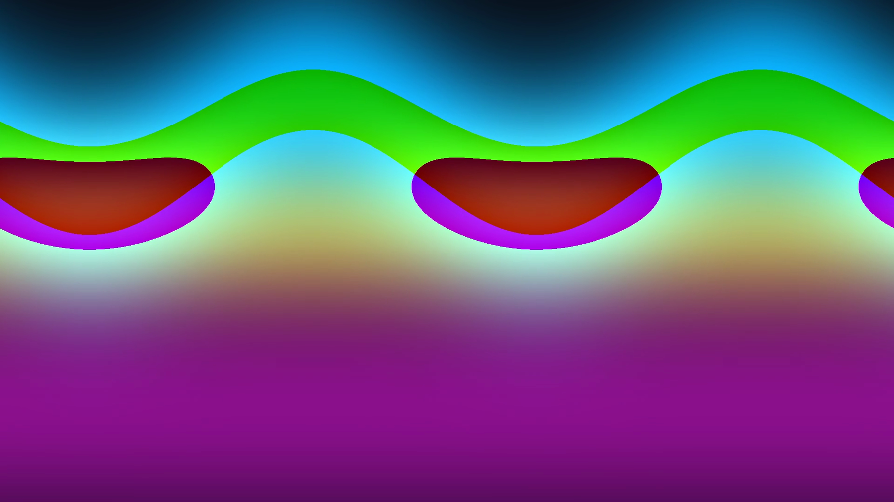

# Edgerunners — Tema para Omarchy

Tema **Cyberpunk 2077: Edgerunners** para [Omarchy](https://omarchy.org/) con
**wallpaper de video en bucle de alta calidad**.

> Preview: 
>
> **Estado:** v0.1.0 — tema + plugin de video (v0.3.0) verificados en máquina
> real (Fases 0-6 del plan). Incluye 2 loops **originales** de neón generados
> por script (H.264 1080p30, sin audio, vía Git LFS) como wallpaper de
> arranque — los clips reales de Edgerunners **no** se distribuyen en este
> repo (ver [Licencia y contenido de terceros](#licencia-y-contenido-de-terceros)).

## Qué incluye
- **Paleta neón** (cian / magenta / amarillo sobre negro Night City) aplicada a
  shell, barra, notificaciones, OSD, terminal y apps.
- **Wallpaper de video**: reproduce en bucle y mudo un clip del tema activo como
  fondo de escritorio, con **fallback automático a imagen**.
- Gestión 100% con los **comandos internos de Omarchy** (instalar, actualizar,
  desinstalar).

## Arquitectura (dos repos)
El sistema de Omarchy separa **temas** y **plugins**:

| Artefacto | Repo | Se instala con | Qué aporta |
|---|---|---|---|
| **Tema** `edgerunners` | `github.com/p3lusa/edgerunners` | `omarchy theme install` | colores, iconos, configs, `backgrounds/`, `videos/` |
| **Plugin** `p3lu.video-background` | `github.com/p3lusa/edgerunners-wallpaper` | `omarchy plugin add` | el renderizador de video (capa de fondo) |

> **¿Por qué dos repos?** `omarchy theme install` clona el repo en la raíz de
> `themes/<nombre>/` (ficheros de tema), y `omarchy plugin add` clona el repo en
> la raíz de `plugins/<id>/` esperando un `manifest.json` en la raíz. No pueden
> compartir la misma raíz → son dos repos. En este proyecto local viven juntos:
> el tema es la raíz (`~/Projects/edgerunners`) y el plugin está anidado en
> `~/Projects/edgerunners/plugin/` (repo independiente, ignorado por el git del
> tema).

## Requisitos
- Omarchy (Hyprland + Quickshell)
- `QtMultimedia` para Quickshell (Qt6) — presente en la distro
- (Recomendado) decodificación por hardware vía Vulkan (AMD / NVIDIA / Intel)

## Instalación (comandos internos de Omarchy)
```bash
# 1) Tema
omarchy theme install https://github.com/p3lusa/edgerunners.git

# 2) Plugin de video
omarchy plugin add https://github.com/p3lusa/edgerunners-wallpaper.git --enable

# 3) Ceder la capa de fondo al renderizador de video (una vez)
omarchy plugin disable omarchy.background

# 4) Aplicar el tema
omarchy theme set edgerunners
```

## Actualización / desinstalación
```bash
# Actualizar (el clone se actualiza; re-aplicar el tema re-stagea los assets)
omarchy theme update
omarchy theme set edgerunners
omarchy plugin update p3lu.video-background

# Desinstalar (restaura el comportamiento de imagen stock)
omarchy theme remove edgerunners
omarchy plugin remove p3lu.video-background --yes
omarchy plugin enable omarchy.background
```

> **Nota:** `omarchy theme update` hace `git pull` en el clone, pero el tema
> activo es una copia staged en `~/.local/state/omarchy/current/theme/` — por
> eso la actualización termina con `omarchy theme set edgerunners` (re-stage +
> transición, sin reiniciar shell).

## Vídeos: dónde van y cómo añadir los tuyos
Los clips viven en **`videos/`** (raíz del repo del tema), un `*.mp4` por
fondo. Cada clip tiene su PNG emparejado en `backgrounds/` **con el mismo
nombre base** (ese PNG es el fallback, el lock screen y lo que ve `bg next`
entre videos).

### Clips personales (uso local)
Este repo solo distribuye los loops originales de `videos/`. Si quieres tus
propios clips (p. ej. de
[moewalls.com/cyberpunk-edgerunners](https://moewalls.com/tag/cyberpunk-edgerunners/),
para uso personal), déjalos como **ficheros no versionados** en el clone
instalado — `git pull` no los toca:

```bash
cp ~/Videos/edgerunners/*.mp4   ~/.config/omarchy/themes/edgerunners/videos/
cp ~/Videos/edgerunners/frames/*.png ~/.config/omarchy/themes/edgerunners/backgrounds/
omarchy theme set edgerunners   # re-stagea el clone completo (incluidos los tuyos)
```

> Si no quieres que aparezcan en `git status`, añade sus nombres a
> `~/.config/omarchy/themes/edgerunners/.git/info/exclude` (solo afecta a
> ese clone, no al repo).

```bash
# Añadir/renovar un clip: re-encódelo con esta receta (1440p30, sin audio)
ffmpeg -i origen.mp4 \
  -vf "scale=2560:1440:flags=lanczos,fps=30" \
  -c:v libx264 -preset medium -crf 23 -profile:v high \
  -an -movflags +faststart -y videos/NOMBRE.mp4

# Y su PNG (frame al 40%, evita fades de apertura)
dur=$(ffprobe -v error -show_entries format=duration -of csv=p=0 videos/NOMBRE.mp4)
ffmpeg -ss "$(awk "BEGIN{printf \"%.3f\", $dur*0.4}")" -i videos/NOMBRE.mp4 \
  -frames:v 1 -q:v 2 backgrounds/NOMBRE.png

# Publicar los cambios (los MP4 van por Git LFS)
git add videos backgrounds && git commit && git push
```

**Spec de los clips** (la recomendada; los loops incluidos son 1080p30):
- `H.264` (decodificación por hardware; HEVC no probado en este stack)
- `2560x1440` (16:9 1440p; el panel de referencia es 2560x1600 y el video se
  recorta con `KeepAspectRatioByExpanding`), `30 fps`
- **Sin pista de audio** — *obligatorio*: el backend FFmpeg de `QtMultimedia`
  (Qt 6.11) no expone `muted`/`volume`, así que un clip con audio sonaría
  como cualquier otro reproductor
- 8-40 s, ~20-40 MB (CRF 23); el bucle es simple (`loops: -1`), el salto del
  punto de loop es inherente a los clips reales
- Coste medido: **~4 % de un núcleo** (AMD 780M, Vulkan H.264) en 1440p30

> **Nota:** `omarchy theme set` re-stagea *todo* el clone (versionado + no
> versionado), así que tus clips personales se incluyen solos en la copia
> staged.

## Cómo funciona el wallpaper de video
- El plugin lee el **tema activo** (`~/.local/state/omarchy/current/theme`) y,
  si ese tema trae `videos/*.mp4`, reproduce el clip en bucle y mudo en la capa
  `Background` (un `MediaPlayer` por panel → multi-monitor).
- **Ciclo:** `omarchy theme bg next` (o `bg set`) avanza al siguiente clip —
  imagen y video avanzan juntos. `omarchy theme set` vuelve al clip 1.
- Si el tema **no** trae `videos/`, el plugin se comporta exactamente como el
  `omarchy.background` stock: pinta la imagen de `current/background`. Así
  `omarchy theme set`, `omarchy theme bg next`, las transiciones y el lock
  screen siguen funcionando igual.
- **Fallback:** MP4 corrupto o indecodificable → se ve el PNG (nunca pantalla
  negra). Verificado: el shell sobrevive a un MP4 basura.

## Estructura del proyecto
```
edgerunners/            ← repo del TEMA (raíz)
├── README.md  PLAN.md  DEBUG-TUNING.md  LICENSE
├── colors.toml  icons.theme
├── mako.ini  hyprlock.conf  ...   (configs por app, Fase identidad)
├── backgrounds/          PNG (fallback + lock)
├── videos/               MP4 (loops)
└── plugin/               ← repo del PLUGIN (anidado, independiente)
    ├── manifest.json
    └── Background.qml
```

## Desarrollo
Ver [`PLAN.md`](PLAN.md) (plan por fases) y [`DEBUG-TUNING.md`](DEBUG-TUNING.md)
(debug y tuning).

## Licencia y contenido de terceros
- **Código y configs:** **MIT** (ver [`LICENSE`](LICENSE)).
- **`videos/` y `backgrounds/` incluidos:** loops originales generados por
  script (ffmpeg `geq`, sin material de terceros) → MIT.
- **Clips de Edgerunners:** este repo **no** incluye clips, frames o
  material derivado de Cyberpunk 2077: Edgerunners (© CDPR / Aniplex /
  Trigger). Añade los tuyos para uso personal con la sección de arriba.

## Créditos
- **[Omarchy](https://github.com/basecamp/omarchy)** (MIT) — la plataforma.
  El plugin `p3lu.video-background` se deriva del plugin stock
  `omarchy.background` de Omarchy (misma licencia MIT).
- **[moewalls.com — Cyberpunk: Edgerunners](https://moewalls.com/tag/cyberpunk-edgerunners/)** —
  inspiración y fuente habitual de los clips que la gente se monta
  (muchos proceden de Steam Community). Los clips que uses son responsabilidad
  tuya: este repo no los distribuye.
